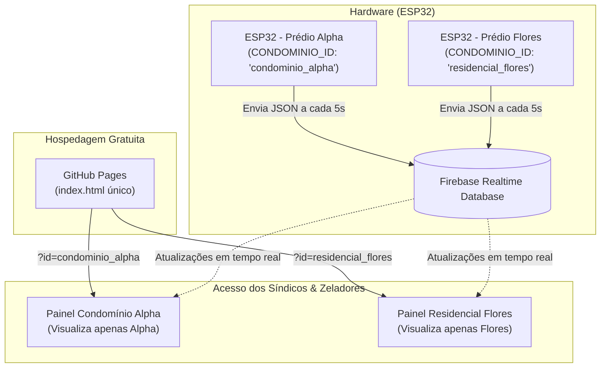

# Sistema Multi-Condomínio de Monitoramento de Caixa d'Água

Sistema de telemetria inteligente para monitoramento em tempo real de nível de reservatórios, status de moto-bombas e consumo elétrico em múltiplos condomínios, utilizando **ESP32**, **Google Firebase Realtime Database** e um **Painel Web Moderno** hospedado gratuitamente no **GitHub Pages**.

---

## 📋 Arquitetura da Solução



---

## 🚀 Passo a Passo de Instalação e Configuração

### Passo 1: Configurar o Firebase Realtime Database

1. Acesse o [Firebase Console](https://console.firebase.google.com/) com a sua conta Google.
2. Clique em **Criar um Projeto**, defina um nome (ex: `aquapulse-condominios`) e desmarque o Google Analytics (dispensável para este projeto).
3. No menu lateral esquerdo, vá em **Criação > Realtime Database** e clique em **Criar banco de dados**.
4. Escolha a região padrão (`us-central1`).
5. Em **Authentication > Sign-in method**, habilite o provedor **E-mail/senha**.
6. Crie uma conta para cada operador e uma conta exclusiva para cada ESP32. Nunca reutilize a senha do Wi-Fi.
7. Na aba **Regras** do Realtime Database, publique o conteúdo de [`firebase.rules.json`](./firebase.rules.json). As regras negam tudo por padrão e liberam cada condomínio apenas aos UIDs autorizados. A atualização das regras no GitHub não as publica automaticamente no Firebase.
8. Em **Dados**, crie o mapa de acesso seguindo [`firebase.access.example.json`](./firebase.access.example.json). O operador recebe `read` para consultar telemetria e calibrar a caixa; o ESP32 recebe `write` para publicar telemetria e sincronizar a calibração. O UID é exibido na lista de usuários do Firebase Authentication.
9. Aplique essas regras antes de publicar o painel. Não utilize `.read: true` ou `.write: true` em produção.
10. Guarde duas informações de configuração:
   - **URL do banco**: Exibida no topo da aba Dados (ex: `https://seu-projeto-default-rtdb.firebaseio.com/`).
   - **Chave de API Web**: Clique na engrenagem ⚙️ ao lado de *Visão geral do projeto > Configurações do projeto > campo Chave de API da Web*.

---

### Passo 2: Programar o ESP32

1. Abra a **Arduino IDE**.
2. Vá em **Ferramentas > Gerenciar Bibliotecas...** e pesquise por:
   - **`Firebase ESP Client`** (desenvolvida por *Mobizt*). Clique em **Instalar**.
   - **`ArduinoJson`** (Benoit Blanchon). Instale a versão **6.21.5**.
3. Abra o arquivo [`esp32/caixadagua_esp32/caixadagua_esp32.ino`](./esp32/caixadagua_esp32/caixadagua_esp32.ino) na Arduino IDE.
4. Copie `secrets.h.example` para `secrets.h`, na mesma pasta do `.ino`, e preencha as credenciais localmente:
   ```cpp
   #define WIFI_SSID       "NOME_DO_WIFI"
   #define WIFI_PASSWORD   "SENHA_DO_WIFI"
   #define API_KEY         "SUA_FIREBASE_WEB_API_KEY"
   #define DATABASE_URL    "https://seu-projeto-default-rtdb.firebaseio.com/"
   #define DEVICE_EMAIL    "conta-exclusiva-do-esp32@seu-dominio.com"
   #define DEVICE_PASSWORD "SENHA_FORTE_EXCLUSIVA"

   #define ENABLE_TELEGRAM         1
   #define TELEGRAM_BOT_TOKEN      "TOKEN_FORNECIDO_PELO_BOTFATHER"
   #define TELEGRAM_CHAT_ID        "CHAT_ID_NUMERICO_DESTE_CONDOMINIO"
   #define TELEGRAM_SIMULATED_MODE false
   ```
5. **Pinagem Recomendada do ESP32**:
   - **Sensor Ultrassônico (JSN-SR04T ou HC-SR04)**:
     - `TRIG` ➔ GPIO 5
     - `ECHO` ➔ GPIO 18 (utilize divisor de tensão se o sensor operar a 5V)
   - **Entrada Analógica (Sensor de Pressão Hidrostática 4-20mA ou 0-5V)**:
     - Utilize pinos do **ADC1** (ex: GPIO 34 ou 35), pois não conflitam com o Wi-Fi.
   - **Monitoramento da Bomba (Status)**:
     - `Entrada Digital (Feedback relé/contator)` ➔ GPIO 19
6. Conecte o ESP32 via cabo USB, selecione a placa (`ESP32 Dev Module`), **Flash Size: 4 MB**, **Partition Scheme: Huge APP (3 MB)**, **Flash Mode: DIO**, **Upload Speed: 115200** e a porta COM. O arquivo `partitions.csv` da pasta do sketch usa o mesmo layout Huge APP.
7. Faça o upload e abra o **Monitor Serial (115200 baud)** para verificar a conexão Wi-Fi, autenticação e envios ao Firebase.

> `secrets.h` está no `.gitignore` e não deve ser enviado ao GitHub. Se a senha anteriormente presente no firmware já foi compartilhada, troque-a no roteador.

> A pasta `esp32/caixadagua_esp32/` é a cópia para abrir na Arduino IDE. Há também arquivos de firmware na raiz por compatibilidade com a estrutura anterior; mantenha as duas cópias sincronizadas até a migração completa.

> A leitura do ACS712 agora usa cálculo RMS, mas os valores `ACS_ZERO_V` e `ACS_SENS_V_A` precisam ser calibrados para o módulo instalado. Nunca conecte saída acima de 3,3 V diretamente ao ESP32 e use isolamento apropriado ao monitorar equipamentos ligados à rede elétrica.

### Telegram por condomínio

O firmware envia notificações diretamente do ESP32 para a API do Telegram, em uma tarefa separada do Firebase. O painel e os caminhos atuais do banco não são alterados.

1. Crie **um bot exclusivo para cada condomínio** no `@BotFather` e guarde o token de cada um.
2. Crie um grupo para o condomínio e adicione apenas o bot correspondente.
3. Descubra o `chat_id` numérico do grupo e grave-o, junto com o token exclusivo, no `secrets.h` daquele ESP32.
4. Não configure webhook nem use o mesmo token em dois ESP32s: os comandos são lidos diretamente pelo dispositivo via `getUpdates` e outro consumidor concorrente causa conflito.
5. Para desativar o recurso sem remover os arquivos, defina `ENABLE_TELEGRAM 0`.

Os avisos carregam o nome e o ID do condomínio. O firmware notifica inicialização, bomba ligada/desligada, falha e recuperação do sensor, sobrecarga, entrada/saída das faixas críticas de nível, alteração da calibração e retorno do Wi-Fi após pelo menos um minuto de interrupção. Também envia um resumo operacional a cada 12 horas de funcionamento e informa variações de nível de pelo menos 10 pontos percentuais, com intervalo mínimo de 5 minutos, fora da faixa crítica. Alertas urgentes têm prioridade; oscilações pequenas não geram mensagens a cada leitura. O HTTPS permanece separado da telemetria Firebase.

No grupo autorizado, use `/status` para nível, volume, bomba e idade da leitura; `/bomba` para estado e corrente; `/ajuda` para a lista de comandos. O bot ignora comandos de outros chats e comandos antigos. Ele apenas consulta dados, sem ligar/desligar a bomba. O dispositivo precisa estar ligado, com Wi-Fi e horário sincronizado para responder. Após gravar o ESP32, teste os comandos e provoque uma mudança controlada para validar os avisos com a instalação real.

O token nunca deve ser colocado no `app.js`, no HTML ou em um nó legível do Firebase. Nenhuma Cloud Function é necessária para esta configuração com um bot por condomínio.

### Instalar no celular como aplicativo

O painel também pode ser instalado como PWA, mantendo a mesma hospedagem GitHub Pages e o mesmo login Firebase. Depois de publicar `manifest.webmanifest`, `sw.js` e a pasta `icons/`, abra o site por HTTPS no celular. No Android/Chrome, use o menu **Instalar app**; no iPhone/Safari, use **Compartilhar → Adicionar à Tela de Início**. O atalho abre o painel sem a barra do navegador e, quando instalado, lembra o último condomínio escolhido naquele aparelho. A leitura ao vivo e o login continuam exigindo conexão com a internet; o cache local guarda apenas arquivos da interface, nunca dados ou senhas do Firebase. Instalar o app não habilita notificações push no celular: os avisos continuam chegando pelo Telegram.

---

### Passo 3: Configurar o Painel Frontend

O frontend já está pronto na raiz do projeto:
- [`index.html`](./index.html): Estrutura semântica, reservatório 3D animado e métricas.
- [`style.css`](./style.css): Interface clara e responsiva para operação predial, com sidebar no desktop, navegação inferior no celular e tanque animado.
- [`app.js`](./app.js): Conexão modular com Firebase Realtime Database, watchdog de heartbeat e simulação.

#### Como definir suas chaves no Frontend:
Existem duas opções práticas:
- **Opção A (Pelo próprio navegador)**: Clique no botão **⚙️ Config** no topo do painel e salve sua Web API Key e Database URL diretamente no navegador. Depois, entre com uma conta do Firebase Authentication autorizada para o condomínio.
- **Opção B (No código fonte)**: Edite as primeiras linhas de [`app.js`](./app.js) substituindo as constantes `DEFAULT_FIREBASE_CONFIG`.

---

### Passo 4: Publicar o Painel no GitHub Pages

1. Acesse o [GitHub](https://github.com/) e crie um novo repositório público (ex: `painel-condominio`).
2. Envie os arquivos da raiz do projeto para o repositório (`index.html`, `style.css`, `app.js`).
3. No repositório, clique em **Settings > menu lateral Pages**.
4. Em **Build and deployment > Branch**, selecione a branch `main` (ou `master`) na pasta `/ (root)` e clique em **Save**.
5. Aguarde cerca de 1 a 2 minutos até que o GitHub gere a sua URL fixa com HTTPS:
   ```text
   https://seu-usuario.github.io/painel-condominio/
   ```

O arquivo `firebase.rules.json` também deve ficar versionado, mas suas regras são publicadas separadamente no Firebase Console. O arquivo `secrets.h` nunca deve ser enviado.

---

### Passo 5: Validação e Entrega aos Síndicos

Com um único site publicado no GitHub Pages, você atende dezenas ou centenas de condomínios apenas variando o parâmetro `?id=`:

- **Para o Prédio A**:
  - Grave no ESP32 o identificador `condominio_alpha`.
  - Envie o link para o síndico:
    ```text
    https://seu-usuario.github.io/painel-condominio/?id=condominio_alpha
    ```

- **Para o Prédio B**:
  - Grave no ESP32 o identificador `residencial_flores`.
  - Envie o link para o síndico:
    ```text
    https://seu-usuario.github.io/painel-condominio/?id=residencial_flores
    ```

- **Para o Prédio C**:
  - Grave no ESP32 o identificador `torre_horizonte`.
  - Envie o link para o síndico:
    ```text
    https://seu-usuario.github.io/painel-condominio/?id=torre_horizonte
    ```

💡 **Vantagem Multi-Tenant**: Qualquer melhoria visual, ajuste ou novo recurso que você publicar no GitHub Pages estará disponível instantaneamente para todos os condomínios, sem necessidade de atualizar o firmware nos ESP32 instalados.

---

## 🧪 Testando Sem Hardware (Modo Demonstração)

Você pode testar e apresentar o sistema para clientes mesmo antes de ligar qualquer hardware:
1. Abra o arquivo [`index.html`](./index.html) no navegador.
2. Clique no botão **✨ Modo Demo** no canto superior direito.
3. O sistema simulará o enchimento e esvaziamento da caixa d'água, o acionamento da bomba, o consumo de energia e os alertas sonoros em tempo real.
